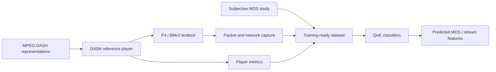

# Software-Defined QoE and Fairness Testbed

[](https://pure.northampton.ac.uk/en/studentTheses/software-defined-intelligent-networks-for-fairness-and-quality-of)
[](https://doi.org/10.3390/network2040030)
[](https://orcid.org/0000-0002-8980-0658)
[](#repository-status)

Research artifacts for **Software Defined Intelligent Networks for Fairness and
Quality of Experience Prediction and Evaluation**, a PhD thesis by
[Ahmed Osama Basil Al-Mashhadani](https://pure.northampton.ac.uk/en/persons/ahmed-osama-basil/).

This repository preserves the programmable-network testbed, HTTP adaptive
streaming media, packet captures, and training/validation data used to study
fairness and predict perceived video quality. It is an archival research
snapshot rather than a maintained production system.

## Research in one minute

The work asks how a programmable network can observe and manage competing
adaptive video streams while treating perceived quality - not only throughput -
as a first-class signal.

The research pipeline combines:

1. MPEG-DASH video at multiple representations;
2. a P4/BMv2 software-defined network testbed;
3. packet, player, and subjective Mean Opinion Score (MOS) observations; and
4. machine-learning models for QoE prediction.

The thesis reports that a bagged-tree classifier predicted MOS with 99.9%
accuracy on the collected dataset, while fine and medium trees achieved 98.8%
for resolution and 97.6% for bitrate. These are results on the thesis dataset,
not general performance guarantees.



## Repository map

| Path | Purpose | Status |
| --- | --- | --- |
| `Testbed/` | P4_16 program, three-switch topology, and BMv2 runtime entries | Core source |
| `HostMonitoring/` | Original packet monitor and a modern CSV-based monitor | Source and legacy source |
| `Collected Data (Used for Training and Validation)/` | MATLAB training/validation dataset | Primary research data |
| `experiment 1/` to `experiment 3/` | Packet captures and MATLAB results from three network trials | Raw experiment evidence |
| `Segments/` | Big Buck Bunny DASH manifest, representations, and media segments | Large media fixture |
| `DASHIF Reference LocalHost Player/` | Local DASH playback page used during experimentation | Third-party-derived fixture |
| `docs/` | Reproduction notes, data dictionary, and limitations | Maintained documentation |

The checkout is approximately 1.8 GB, primarily because the media fixture is
committed directly to Git.

## Quick start

### 1. Inspect the testbed

The P4 program targets the BMv2 `v1model` architecture and uses
`simple_switch_grpc`. Its Makefile expects the shared utilities from a compatible
[`p4lang/tutorials`](https://github.com/p4lang/tutorials) checkout:

```bash
git clone https://github.com/p4lang/tutorials.git
cp -R Testbed tutorials/exercises/qoe-testbed
cd tutorials/exercises/qoe-testbed
make run
```

P4 and tutorial releases change over time; this repository does not pin the
original VM image. See [Reproducibility](docs/REPRODUCIBILITY.md) before trying
to reproduce the historical environment.

### 2. Monitor HTTP requests

The maintained helper records traffic involving a target IPv4 address as CSV:

```bash
python -m pip install -r requirements.txt
python HostMonitoring/http_request_monitor.py 10.0.1.1 \
  --interface any \
  --output observations.csv
```

TShark must be installed and packet capture may require elevated privileges.
The warning threshold is an observation aid, not a DDoS detector.

### 3. Interpret the data

Start with the [data dictionary](docs/DATA_DICTIONARY.md). The MATLAB file is
the preserved training/validation artifact; the model-building scripts described
in the thesis are not included in this snapshot.

## Publications

- A. O. B. Al-Mashhadani, M. Mu, and A. Al-Sharbaz,
  "[Quality of Experience Experimentation Prediction Framework through
  Programmable Network Management](https://doi.org/10.3390/network2040030),"
  *Network*, 2(4), 500-518, 2022.
- A. O. Basil, M. Mu, and A. Al-Sherbaz,
  "[Novel Quality of Experience Experimentation Framework Through Programmable
  Network Management](https://doi.org/10.1109/CCNC49033.2022.9700708),"
  *2022 IEEE 19th Annual Consumer Communications & Networking Conference
  (CCNC)*, 485-486, 2022.
- A. O. Basil, M. Mu, and A. Al-Sherbaz,
  "[A Software Defined Network Based Research on Fairness in
  Multimedia](https://doi.org/10.1145/3347447.3356750),"
  *FAT/MM '19*, 11-18, 2019.

The complete thesis and publication list are available through the
[University of Northampton Research Explorer](https://pure.northampton.ac.uk/en/persons/ahmed-osama-basil/).

## Citation

If this repository contributes to your work, cite the thesis and the relevant
publication. GitHub can generate citation metadata from
[`CITATION.cff`](CITATION.cff).

> Ahmed Osama Basil Al-Mashhadani. *Software Defined Intelligent Networks for
> Fairness and Quality of Experience Prediction and Evaluation*. PhD thesis,
> University of Northampton, 2024.

## Repository status

This is a preservation-focused release of legacy PhD work. Raw captures and
datasets are intentionally left unchanged. Known constraints are documented in
[Known limitations](docs/KNOWN_LIMITATIONS.md).

No software or data licence has yet been declared. Copyright remains with the
relevant authors and asset owners; contact the author before reuse beyond rights
already granted by law or by the cited publications.
